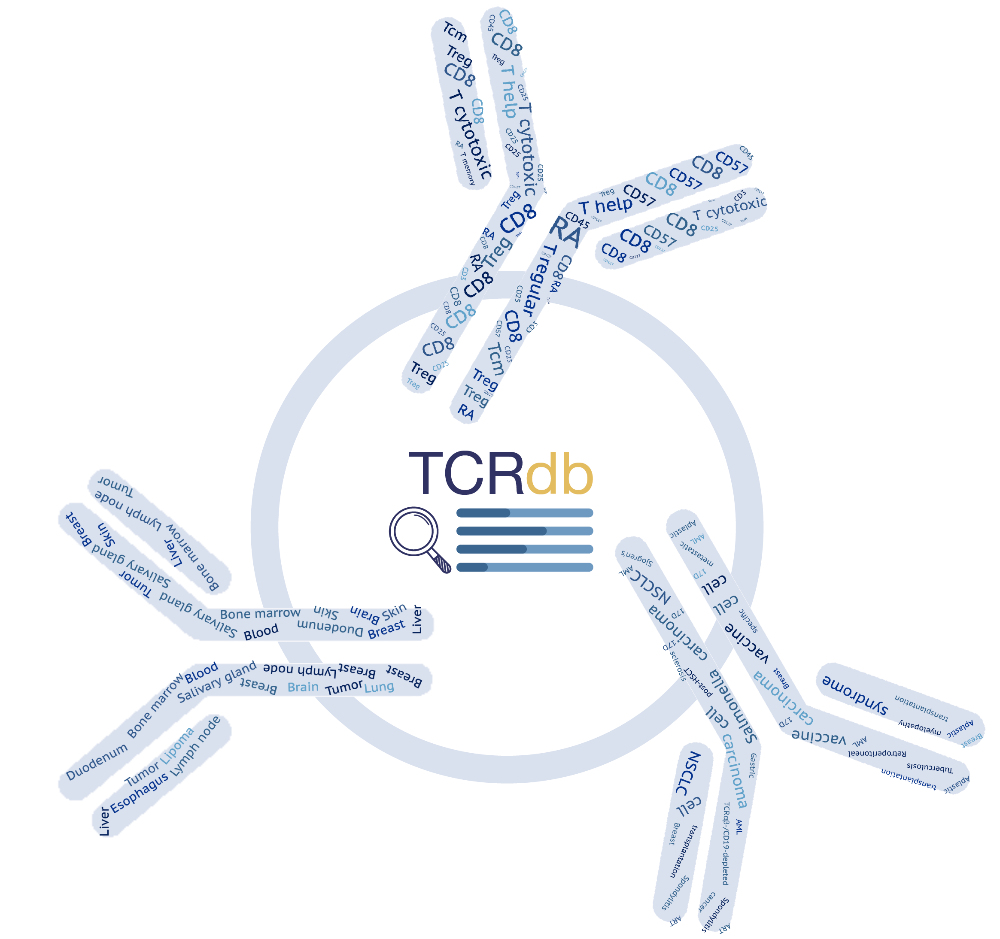

# TCRdb(2.0): A comprehensive database of T-cell receptor sequences

The unique features of TCRdb include: 
* Comprehensive and reliable sequences for TCR repertoire in different samples generated by a strict and uniform pipeline of TCRdb;  
* Powerful search function, allowing users to identify their interested TCR sequences in different conditions; 
* Categorized sample metadata, enabling comparison of TCRs in different sample types; 
* Interactive data visualization charts, describing the TCR repertoire in TCR diversity, length distribution and V-J gene utilization.

The TCRdb database is freely available at [https://guolab.wchscu.cn/TCRdb/ ](https://guolab.wchscu.cn/TCRdb/#/ )

## Newly Update
* A substantial increase in data volume, with the number of TCR samples growing from 8,265 to 19,701 and the number of TCR sequences expanding from 277 million to about 700 million
* Construction of the largest TCR reference in healthy samples, which contains 1,888 samples labeled as healthy controls from 40 published studies.
* New search function, supporting batch search.
* Redesigned download function

The latest TCRdb2.0 is freely available at [https://guolab.wchscu.cn/TCRdb2.0/ ](https://guolab.wchscu.cn/TCRdb2/#/ ) !!!!!

## Description

`CATT .smk`, `MiXCR.smk`, `IMSEQ.smk`: The parameters used for each method.

`Download.smk`： For data download from NCBI (Deprecated in TCRdb 2.0). 

`QC_single/double.smk`: For raw data quanlity control.

All the pipepines were written in Snakemake.

## Citing

Si-Yi Chen, Tao Yue, Qian Lei, An-Yuan Guo, TCRdb: a comprehensive database for T-cell receptor sequences with powerful search function, *Nucleic Acids Research*, , gkaa796, https://doi.org/10.1093/nar/gkaa796

Tao Yue1, Si-Yi Chen, Wen-Kang Shen, Yu Liao, Qian Lei1, An-Yuan Guo, TCRdb 2.0: an updated T-cell receptor sequence database, unpublished
